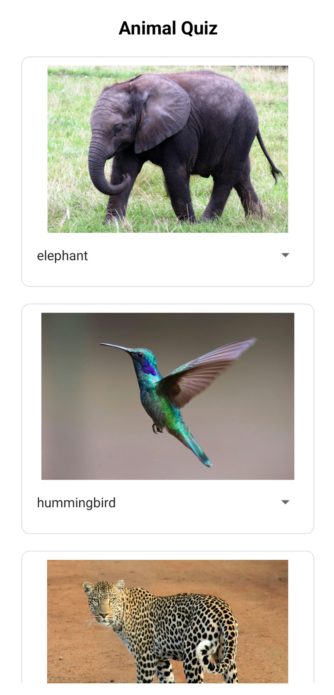
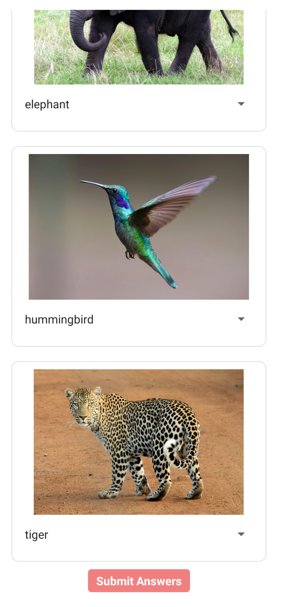

# 🌙 C346 Week03 Lesson06 (Animal Quiz App)

[](#)
[](#)
[](#)
[](#)

---

## 📝 Overview

Lessons 5 & 6 taught us on several Components that can be used in react native such as TextInput, Button, TouchableOpacity, Picker (with npm install), Alert and Toast Android. Additionally, we learned on how to use states in our apps.

> ✨ _Example:_ Implemented a state to capture user answers in React Native.

---

## 🎬 Demo / Media


<p align="center">
  
  
</p>

---

## 🚀 Features

- ✅ Reusable components
- ✅ Use of states
- ✅ Varied kinds answer options for each question

---

## 💡 Key Concepts

| Concept        | Description                     |
| :------------- | :------------------------------ |
| **Components** | Picker                          |
| **Props**      | Passing data between components |
| **State**      | State to capture user answer    |

---

## 🧱 Code Snippet

```jsx
<View style={styles.card}>
  <Image source={question.photo} style={styles.image} />
  <Picker value={userAns} onValueChange={handleValueChange}>
    {question.options.map((element) => (
      <Picker.Item label={element} value={element} />
    ))}
  </Picker>
</View>
```
